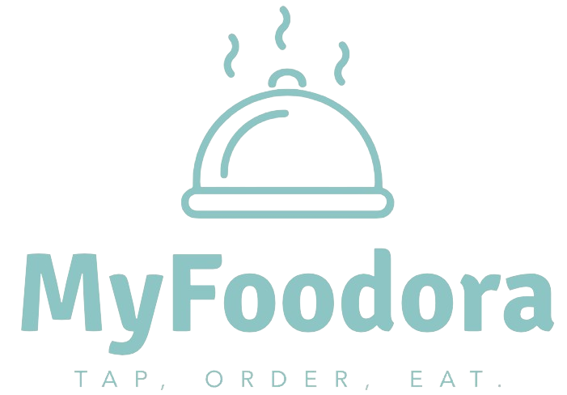

# MyFoodora - Food Delivery System

## Overview

MyFoodora is a Java-based software solution for a food delivery system, similar to existing platforms like Foodora and Deliveroo. This project was developed as part of the Object-Oriented Software Engineering course at CentraleSupélec. The goal is to provide a platform for customers to order food from various restaurants, manage deliveries, and handle user interactions through a command-line interface (CLI).

## Features

### Core System
- **Restaurants**: Manage menus, create meals, set discount factors, and offer special deals.
- **Customers**: Place orders, register for fidelity plans, and access account information.
- **Couriers**: Manage delivery status, accept delivery tasks, and track completed orders.
- **Managers**: Oversee system operations, manage users, and compute business statistics.

### Functionalities
- **Menu and Meal Management**: Restaurants can edit menus, create meals, and set special offers.
- **Order Processing**: Customers can place orders either à la carte or from predefined meals, with pricing policies based on fidelity plans.
- **Delivery Management**: The system allocates couriers for deliveries based on various policies (fastest delivery, fair-occupation).
- **Profit Management**: Managers can set service fees, markup percentages, and delivery costs to meet target profits.
- **Notifications**: Customers can opt-in to receive notifications about special offers.
- **Pricing and Fidelity Cards**: Manage different types of fidelity cards and apply relevant pricing rules.
- **Command-Line and Graphic Interface**: a CLI and GUI for interacting with the MyFoodora system, allowing users to enter commands for various operations.

